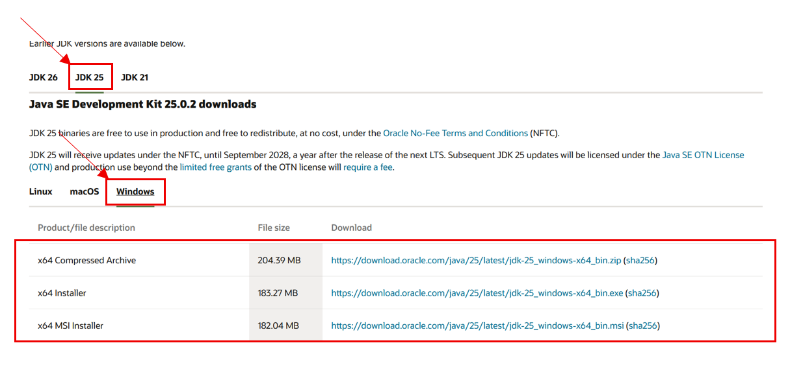
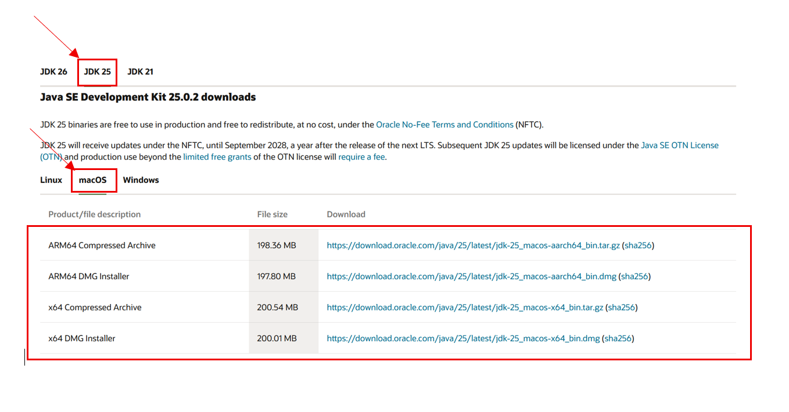
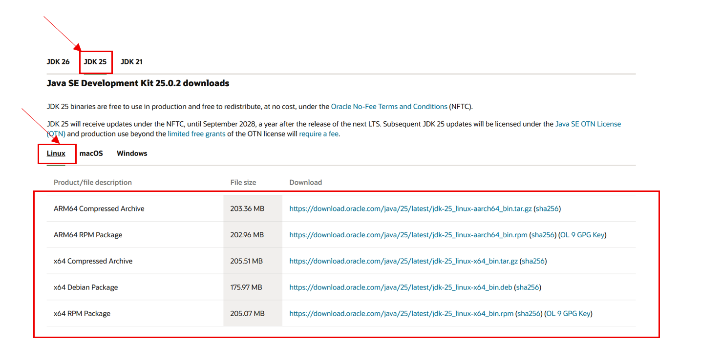

# Video Game Collaborative Test

**Plateforme d’évaluation collaborative de jeux vidéo**

## Prérequis

* Avoir **Java 25** installé sur votre machine.
* Pour Windows : téléchargez-le depuis le site officiel :
  [Oracle JDK 25 pour Windows](https://www.oracle.com/java/technologies/downloads/#jdk25-windows)
  * 

* Pour MacOs : téléchargez-le depuis le site officiel :
  [Oracle JDK 25 pour MacOs](https://www.oracle.com/java/technologies/downloads/#jdk25-mac)
    * 

* Pour Linux : téléchargez-le depuis le site officiel :
  [Oracle JDK 25 pour Linux](https://www.oracle.com/java/technologies/downloads/#jdk25-linux)
    * 

## Installation du projet

1. Téléchargez le ZIP du projet :
   [ZIP du projet](https://drive.google.com/drive/folders/1crw2itIsQm8NJwkgT-FYsBX4JCSdrJV8?usp=sharing)

2. Dézippez-le dans le dossier de votre choix.


## Lancement du programme (WINDOWS)

1. Ouvrez le dossier `script/`.
2. Double-cliquez sur `launch.bat`.
3. Le programme devrait se lancer automatiquement.

**ATTENTION** : Assurez-vous que le JDK 25 est correctement configuré et que `launch.bat` pointe vers le bon chemin du JAR et des fichiers de données (`data/vg_data.csv`).

## Lancement du programme (MACOS)

1. Ouvrez le dossier `script/`.
2. Donnez les droits d'écriture au fichier launch.sh (chmod +x script/launch.sh)
3. Lancez launch.sh : ./script/launch.sh
4. Le programme devrait se lancer automatiquement.


---

### Lancement du programme (macOS / Linux)

1. Ouvrez le **Terminal**.
2. Placez-vous dans le dossier du projet.
3. Donnez les droits d’exécution au script :

```bash
chmod +x script/launch.sh
```

4. Lancez l’application :

```bash
./script/launch.sh
```

Le programme devrait se lancer automatiquement.